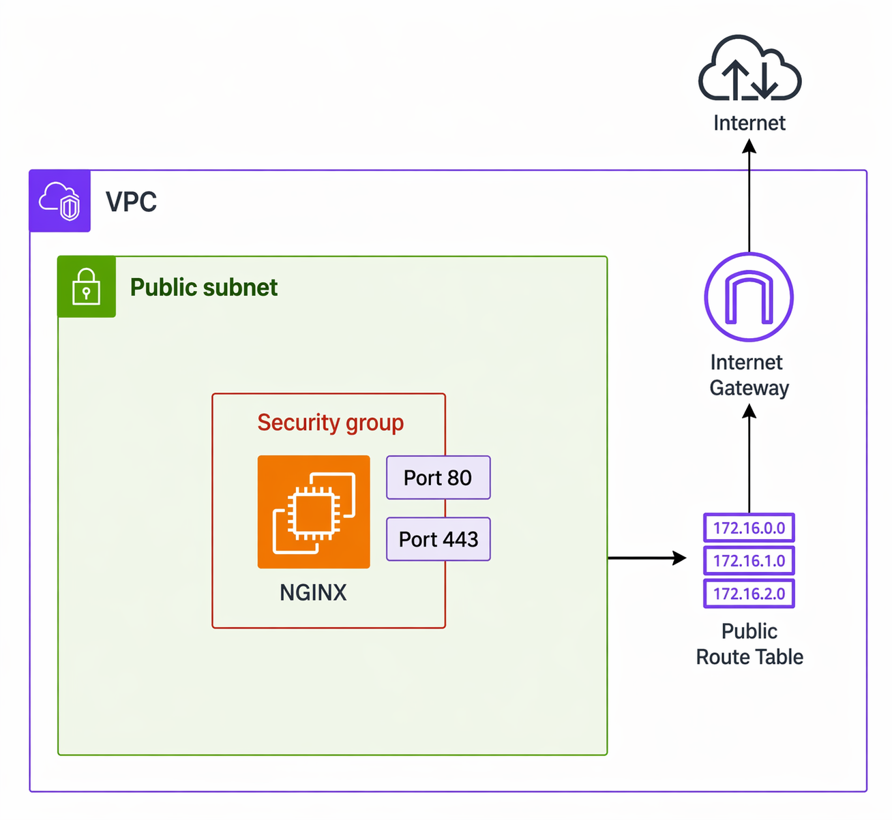

# AWS VPC Architecture - Public Subnet with NGINX

  

Este proyecto documenta una arquitectura fundacional en AWS diseñada para exponer un servidor web (NGINX) a Internet utilizando una **VPC con una única subred pública**. Este diseño está estructurado para ser aprovisionado como Infraestructura como Código (IaC) mediante **Terraform**.

---

## Arquitectura

La infraestructura se compone de los siguientes recursos principales de AWS:

- **VPC (Virtual Private Cloud)**
- **Public Subnet**
- **Internet Gateway**
- **Route Table (Public RTB)**
- **Security Group**
- **EC2 Instance (NGINX)**

---

## 1. VPC (Virtual Private Cloud)

La VPC representa el entorno de red lógicamente aislado donde se despliegan los recursos.

- Define un bloque CIDR de direcciones IP privadas (ej. `172.16.0.0/16`).
- Proporciona un control granular sobre la topología de la red virtual.
- Actúa como el límite de red fundamental para la infraestructura alojada.

---

## 2. Public Subnet

Una subred pública es una segmentación de la VPC que permite la conectividad directa con Internet.

- Utiliza un sub-bloque del CIDR principal de la VPC (ej. `172.16.1.0/24`).
- Contiene los recursos de computación accesibles públicamente, en este caso, la instancia EC2 con NGINX.
- **Nota técnica:** Una subred adquiere la característica de "pública" exclusivamente cuando su tabla de enrutamiento asociada dirige el tráfico no local hacia un Internet Gateway.

---

## 3. Internet Gateway (IGW)

El Internet Gateway es el componente administrado por AWS que habilita la comunicación bidireccional entre la VPC e Internet.

- Servicio gestionado, altamente disponible y con escalado horizontal automático.
- Traduce las direcciones IP privadas a direcciones IP públicas (NAT 1:1) para las instancias dentro de la VPC.

---

## 4. Route Table (Public RTB)

La tabla de enrutamiento define las reglas (rutas) que determinan hacia dónde se dirige el tráfico de red de la subred.

**Configuración base:**

- **Ruta local:** `172.16.0.0/16` → `local` (Garantiza la comunicación interna entre los recursos de la VPC).
- **Ruta pública:** `0.0.0.0/0` → `Internet Gateway` (Enruta el tráfico externo hacia Internet).

---

## 5. Security Group

El Security Group opera como un firewall virtual a nivel de capa de red/transporte (Capa 3/4 del modelo OSI) asociado a las interfaces de red (ENI) de las instancias EC2.

### Reglas de Entrada (Inbound):

- **Puerto 80 (TCP):** Permitido desde `0.0.0.0/0` para tráfico HTTP.
- **Puerto 443 (TCP):** Permitido desde `0.0.0.0/0` para tráfico HTTPS.

### Reglas de Salida (Outbound):

- **Todos los puertos:** Permitido hacia `0.0.0.0/0` por defecto, facilitando la descarga de paquetes y actualizaciones.

**Características técnicas:**
Los Security Groups en AWS son _stateful_. Esto significa que si se permite una solicitud entrante, la respuesta saliente correspondiente se permite automáticamente, independientemente de las reglas de salida configuradas.

---

## 6. EC2 Instance (NGINX)

Recurso de cómputo (máquina virtual) aprovisionado dentro de la subred pública.

- Sistema Operativo configurado para ejecutar el servidor web o proxy inverso **NGINX**.
- Vinculado al Security Group definido para aceptar tráfico web estándar.
- Requiere la asignación de una IP Pública o Elastic IP para ser accesible desde el exterior de la VPC.

---

## Flujo de Tráfico de Red

### Solicitud Entrante (Inbound Request)

1. El cliente inicia una conexión TCP hacia la IP pública de la instancia (ej. puerto 80 o 443).
2. El tráfico atraviesa el **Internet Gateway** de la VPC.
3. La **Route Table** resuelve el enrutamiento y dirige el paquete hacia la **Public Subnet**.
4. El tráfico llega a la Elastic Network Interface (ENI) de la **Instancia EC2**.
5. El **Security Group** evalúa las reglas y autoriza el tráfico.
6. El servicio **NGINX** captura y procesa la petición HTTP/HTTPS.

### Respuesta Saliente (Outbound Response)

1. NGINX elabora la respuesta HTTP.
2. El paquete se transmite desde la instancia EC2.
3. El **Security Group** autoriza la salida automáticamente debido a su naturaleza _stateful_.
4. El paquete sigue la ruta por defecto (`0.0.0.0/0`) definida en la **Route Table**, apuntando hacia el **Internet Gateway**.
5. El Internet Gateway enruta el paquete a través de la infraestructura perimetral de AWS hacia el cliente final.

---

## Resumen de la Arquitectura

| Componente           | Función Principal                                         |
| :------------------- | :-------------------------------------------------------- |
| **VPC**              | Perímetro de red privada y aislada a nivel lógico.        |
| **Public Subnet**    | Espacio de direcciones con ruta directa al exterior.      |
| **Internet Gateway** | Nodo de interconexión entre la VPC e Internet.            |
| **Route Table**      | Matriz de control de tráfico a nivel de red.              |
| **Security Group**   | Firewall _stateful_ aplicado a las instancias de cómputo. |
| **EC2 + NGINX**      | Nodo de procesamiento de peticiones web.                  |

---

## Consideraciones y Limitaciones

El presente diseño constituye una arquitectura _Single-Node_ o básica. No debe ser considerado _production-ready_ debido a las siguientes restricciones:

- **Ausencia de Balanceo de Carga (Load Balancing):** Todo el tráfico recae en un único nodo, creando cuellos de botella en altos volúmenes de tráfico.
- **Falta de Alta Disponibilidad (HA):** La dependencia de una única instancia en una sola Zona de Disponibilidad (AZ) introduce un Punto Único de Fallo (SPOF).
- **Escalabilidad Manual:** No hay políticas de Auto Scaling implementadas para gestionar incrementos de demanda.
- **Exposición Directa:** No existe una capa de separación (DMZ / Subredes Privadas) para aislar servicios críticos, como bases de datos o lógica de aplicación profunda.

---

## Casos de Uso Recomendados

- Entornos de Desarrollo o Pruebas (Dev/Test).
- Despliegues de Prototipos de Concepto (PoC).
- Laboratorios de formación sobre Infraestructura como Código y Redes Cloud.
- Alojamiento temporal de aplicaciones estáticas sin requerimientos de alta criticidad.

---

## Evolución de la Arquitectura (Mejoras Futuras)

Para transformar esta infraestructura en un entorno resiliente y apto para entornos de Producción, se deben considerar las siguientes implementaciones:

- **Application Load Balancer (ALB):** Integración de un balanceador para distribuir el tráfico entrante sobre múltiples instancias.
- **Auto Scaling Group (ASG):** Configuración de grupos de escalado para gestionar dinámicamente la capacidad de cómputo basada en métricas del sistema.
- **Topología Multi-Tier:** Reestructuración de la VPC incorporando **Private Subnets** para recursos de cómputo (backend/bases de datos) y **Public Subnets** exclusivas para balanceadores y bastiones (NAT Gateways).
- **Web Application Firewall (WAF):** Despliegue de un WAF en el Load Balancer para mitigar amenazas a nivel de capa 7 (DDoS, SQLi, XSS).
